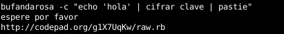

# Bufanda Rosa

Este programa permite **cifrar** y **descifrar** mensaje o archivos para enviarlos por correo electrónico, publicarlo, compartir de modo anónimo. 
También nos permitirá guardar información de cualquier tipo dentro de una **imagen** o **audio** o generar códigos **QR** con el mensaje cifrado.

## Instalar

<pre>
cd /tmp
wget https://github.com/b4zz4/BufandaRosa/archive/master.zip
unzip master.zip
cd BufandaRosa-master/
chmod +x bufandarosa
chmod +x wgetpaste
sudo cp wgetpaste /usr/bin/
./bufandarosa -i
</pre>

## Vieja escuela

Linea de comandos para Bufanda Rosa.

<pre>
echo "echo 'hola mundo' | pastie" | bufandarosa -c
</pre>
> publica `hola mundo` en un pastie de modo anonimo

<pre>
echo ayuda | bufandarosa -c
</pre>
> ayuda de la versión de terminal

# Wgetpaste

intento manterner la ultima versión en el repo. [Sitio original](http://wgetpaste.zlin.dk/)
