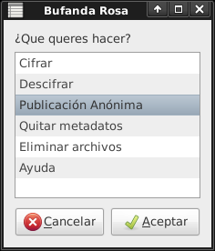
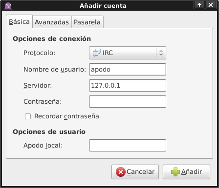
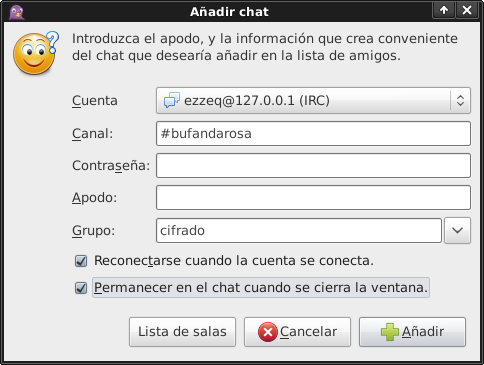
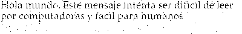

#  Bufanda Rosa

Este programa permite **cifrar** y **descifrar** mensaje o archivos para: enviarlos por correo electrónico, publicarlo o compartir de modo anónimo (con **TOR**). 
También nos permitirá guardar información, de cualquier tipo, dentro de una **imagen**,  **archivo de audio** o generar códigos **QR** con el mensaje cifrado.
Y chatear de modo cifrado en cualquier servidor de **IRC**.

## Instalar

~~~
cd /tmp
wget https://raw.github.com/b4zz4/BufandaRosa/master/bufandarosa
bash bufandarosa -u
~~~

=======

## Cifrado

Cifra mensajes, archivos con la posibilidad de grabarlos, salvarlo en **QR** u ocultar el mensaje en una imagen o archivos de audio y publicarlos de modo anónimo con **TOR**.

## Descifrado

Descifra mensajes cifrado con **Bufanda Rosa**.

## Publicación anónima

Publica en un pastie usando **TOR** para su anonimato.

_**Nota:** una vez publicado el mensaje solo debe verse con **TOR** para no dejar rastros._

## IRC cifrado

Genera un desvío de cualquier servidor IRC, cifrando los mensajes de salida y descifrando los de entrada. 
Por ejemplo podemos utilizar `irc.freenode.net` y la clave de cifrado `1234`.

~~~
echo "irc irc.freenode.net 6697 1234 6667" | bufandarosa -c
~~~
> Esto también se puede hacer con la interfaz gráfica

> Luego, debemos correr un cliente de IRC (por ejemplo [Pidgin](https://pidgin.im/)) y conectarlo al servidor `127.0.0.1`

> Conectarnos al canal `#bufandarosa` (por ejemplo).

Esta inspirado en el concepto de [dirtirc](http://dirtirc.sf.net), pero con un cifrado mucho más fuerte basado en [GPG](http://www.gnupg.org/index.es.html).

_**Nota:** NO anonímiza la conexión, solo nuestros mensajes._

## Quitar metadatos

Elimina los metadatos de una archivo e intenta generar "ruido" para que sea imposible detectar su origen.

_**Nota:** La generación de "ruido" es experimental._

## Eliminar archivos

Borra cualquier archivo sin dejar rastros.

====

## Vieja escuela (o versión cli)

Linea de comandos para Bufanda Rosa.

~~~
bufandarosa -c
~~~
> terminal de Bufanda Rosa. `ctrl+c` o `ctrl+d` para cerra la terminal bufandarosa.

~~~
echo "echo 'hola mundo' | pastie" | bufandarosa -c
~~~
> publica `hola mundo` en un pastie de modo anónimo

~~~
echo 'echo "hola" | cifrar clave | descifrar clave' | bufandarosa -c
~~~
> cifra y descifra un mensaje con clave

~~~
echo "echo mensaje cifrado y almacenado en un QR | cifrar 1234 | qr | publicar" | bufandarosa -c 
~~~
> Guardar un mensaje cifrado con clave `1234` dentro de un QR

~~~
echo "descarga https://raw.github.com/b4zz4/BufandaRosa/master/img/qr.png | descifrar 1234 " \
| bufandarosa -c
~~~
> Descarga la imagen del QR y la descifra con la clave `1234`

~~~
echo "echo Hola mundo. Este mensaje intenta ser dificil de leer \
por computadoras y facil para humanos | viagra | publicar" | bufandarosa -c 
~~~
> Ofuscado de texto usando pixels (estilo publicada de viagra)

~~~
echo ayuda | bufandarosa -c
~~~
> ayuda de la versión de terminal

=====

## Lista de quehaceres

* Imágenes al azar más diversas fuentes
* Publicación de imágenes, QR y archivos de modo automática (ya comence este pendiente)
* Cifrar usando [OTR](http://www.cypherpunks.ca/otr/)
  * hacer que el cifrado del IRC sea multiparty (basado en OTR)
* IRC como proxy y tuberias para hablar de modo ofuscado (l33t, greeklish, errores de tipeo, h4x0r, disgrafía, etc)
* En IRC al enviar "\" no recibe nada, hay que cambiarlo por "\\\\"
* Leer feed en búsqueda de mensajes cifrados
* Cifrado para poner en una URL, ejemplo: `data:text/html;charset=utf-8,`
* Enviar GPG gráfica: `gpg --export -a bazza@riseup.net | qrencode -ivS -s 2 -m 1 -o gpg.png`
  * con esto la idea seria enviar la llave gpg + un mensaje cifrado sobre una imagen linda, al comprartir las llaves de este modo podes coleccionarla y compartirlas con tus amigos sumando imagenes a sus llaveros

# Wgetpaste

Intento mantener la ultima versión. [Sitio original](http://wgetpaste.zlin.dk/)

