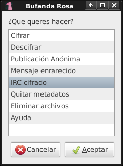

#  Bufanda Rosa

Este programa permite **cifrar** y **descifrar** mensaje o archivos para: enviarlos por correo electrónico, publicarlo o compartir de modo anónimo (con TOR). 
También nos permitirá guardar información, de cualquier tipo, dentro de una **imagen**,  **archivo de audio** o generar códigos **QR** con el mensaje cifrado.
Y chatear de modo cifrado en cualquier servidor de IRC.

## Instalar

<pre>
cd /tmp
wget https://raw.github.com/b4zz4/BufandaRosa/master/bufandarosa
bash bufandarosa -u
</pre>

## IRC cifrado

Genera un desvío de cualquier servidor IRC, cifrando los mensajes de salida y descifrando los de entrada. 
Por ejemplo podemos utilizar `irc.freenode.net` y la clave de cifrado `1234`.

<pre>
echo "irc 'irc.freenode.net 6667' 1234 6667" | bufandarosa -c
</pre>

> Luego, debemos correr un cliente (por ejemplo [Pidgin](https://pidgin.im/)) y conectarlo al servidor `127.0.0.1`

> Conectarnos al canal `#bufandarosa` (por ejemplo).

Esta inspirado en el concepto de [dirtirc](http://dirtirc.sf.net), pero con un cifrado mucho más fuerte basado en [GPG](http://www.gnupg.org/index.es.html).

**Nota:** NO anonimiza la conexión, solo nuestros mensajes.

## Vieja escuela

Linea de comandos para Bufanda Rosa.

<pre>
echo "echo 'hola mundo' | pastie" | bufandarosa -c
</pre>
> publica `hola mundo` en un pastie de modo anonimo

<pre>
echo ayuda | bufandarosa -c
</pre>
> ayuda de la versión de terminal

## Quehaceres

* En IRC al enviar "\" no recibe nada, hay que cambiarlo por "\\"
* Imágenes al azar de diversas fuentes
* Publicación de imágenes automática
* Cifrar usando [OTR](http://www.cypherpunks.ca/otr/)
* hacer que el cifrado del IRC sea multiparty (basado en OTR)
  * Cifrado con llave GPG `echo "hola" | gpg -r $ID -e - | gpg -r $ID --passphrase $CLAVE -d -`
  * Soporte para SSL
  * ~~Tor para freenode~~ posiblemente con salto entre servidores
* Leer feed en busqueda de mensajes cifrados

# Wgetpaste

Intento mantener la ultima versión. [Sitio original](http://wgetpaste.zlin.dk/)
